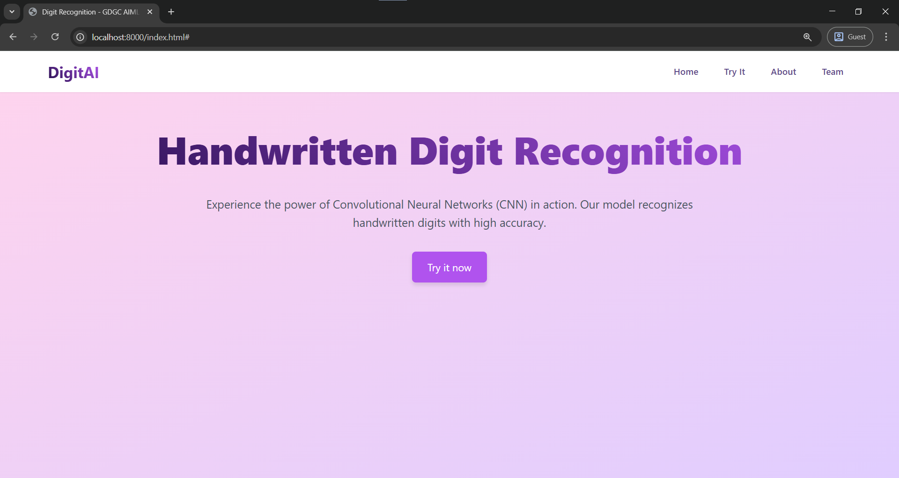

# DigitAI – Handwritten Digit Recognition using CNN

**DigitAI** is an online application that employs a trained Convolutional Neural Network (CNN) model for recognition of handwritten digits from uploaded pictures. Developed by the GDGC AIML Team, it provides an interactive frontend to upload digit pictures and get predictions in real-time via TensorFlow.js.


## Features

- **Handwritten Digit Prediction**
  - Upload a digit image and predict with high precision using CNN.
  - Real-time prediction feedback with digit preview.

- **Client-Side Model Inference**
  - No backend required — driven by TensorFlow.js natively in the browser.

- **Clean UI & Navigation**
  - Pages: Home, Try It, About, and Team.
  - Responsive design with seamless section switching.

- **User Guidance**
  - Instruction box to assist users in uploading correct digit images.
  - Unambiguous UI feedback (loading, preview, prediction result).


## Tech Stack

- **Frontend**: HTML, CSS (Tailwind), JavaScript
- **ML Library**: TensorFlow.js
- **Model**: Trained CNN on MNIST dataset (converted for browser)


## Getting Started

### 1. Clone the Repository

```bash
git clone https://github.com/your-username/DigitAI.git
cd DigitAI
```

### 2. Run Locally (No Python Needed!)

```bash
# Use any local server (e.g., Python HTTP server)
python -m http.server 8000
# Visit http://localhost:8000/index.html
```

> Alternatively, you can open `index.html` directly in a browser, but some features may not work due to local file restrictions.


## Screenshots

1. **Home Page** – Project introduction and call-to-action.


2. **Digit Prediction Page** – Upload an image and see predictions.


3. **Making the Prediction** – Shows the prediction.


4. **About the idea** – Shows the data about the project.


5. **Team Section** – Showcasing contributors and their roles.


## Project Structure

```bash
DigitAI/
│
├── tsjsmodel/                 # Trained TensorFlow.js model
│   ├── model.json
│   └── group1-shard1of1.bin
│
├── screenshots/               # Screenshots for documentation
│   └── home.png
│   └── predict.png
│   └── instructions.png
│   └── team.png
│
├── index.html                 # Main frontend file
├── style.css                 # Custom styles
├── script.js                 # Main JS (UI logic & model inference)
├── navigation.js             # Section navigation logic
├── digit_recognition.ipynb   # Python notebook used to train the CNN model
├── digit_recognition_model.h5 # Original Keras-trained model
├── requirements.txt          # Python dependencies (if you want to train model again)
└── README.md
```


## Future Work

- Include live drawing canvas for digits
- Enhance prediction feedback with confidence score
- Enlarge the model to accommodate multi-digit recognition
- Add backend support (Flask/FastAPI) for enhanced features


Made with ❤️ by the **GDGC AIML Team**

Contributors: Divya, Pritish, Abhishek, Harshavardhan, Jai V Pavan, Trishala
